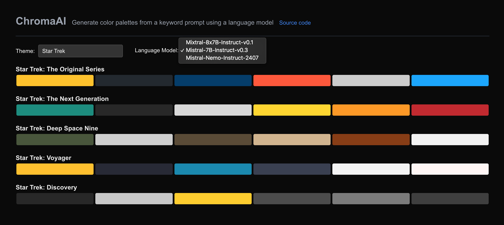
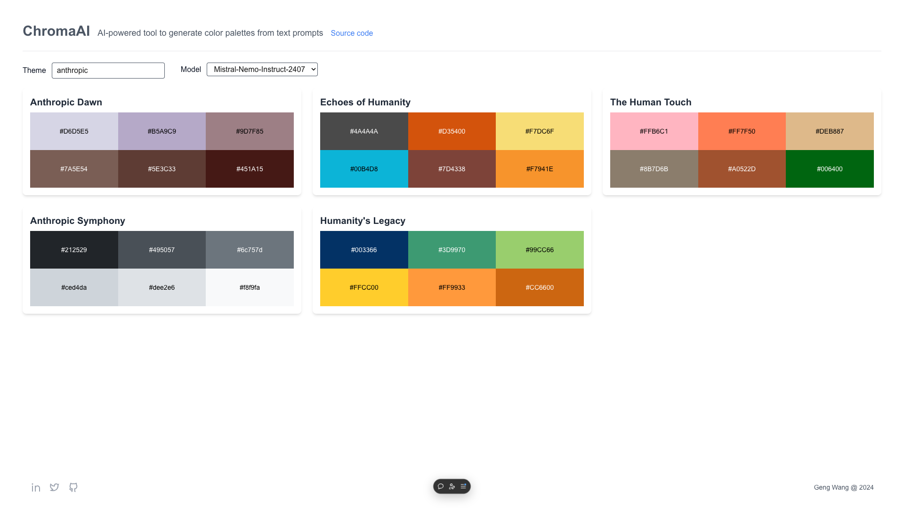
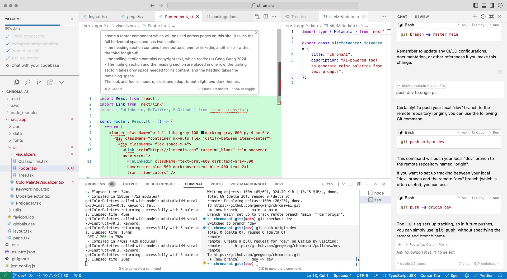
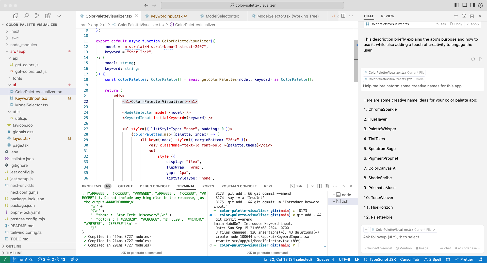
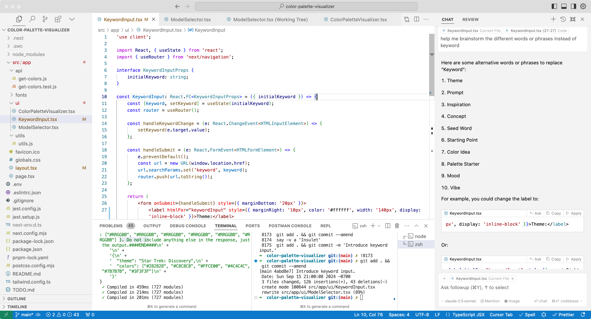

# Chroma AI

Generate color palettes from keywords using AI.

A weekend project exploring LLMs and prompt engineering with Hugging Face JS and Next.js. This exciting dive into AI development was my first hands-on experience building an app with language models.

## AI vs Human Design Comparison

Key takeaway: "The future is now!"

Check out these color palette component UIs:
- Human-designed: Created by me using traditional methods.

- AI-generated: Created by me using Cursor (and Claude-3.5-sonnet).

My initial draft took several tries and likely more time, while Cursor's AI-generated version was its first attempt. It's a clear demonstration of how AI is changing the game in design.

## How LLMs help build this app

- Generate & edit code

- Brainstorm ideas

- Copy writing & editing

## Takeaways

- The future is now.
  - Human expertise remains crucial for direction-setting, effective planning, and divide-and-conquer between humans and AI.
  - Success requires understanding both the overall vision and specific details. Human craftsmanship will not become obsolete.
  - Currently, LLM-generated UI is quick and good enough, making it ideal for demos or prototypes.
  - In the future, LLMs will be able to generate the **entire design system**, or having its ***own taste and style.***
- The human (You) drives the project, not the AI:
  - Provide clear, specific instructions.
  - Divide complex tasks into smaller, manageable prompts.
  - Double-check the output critically.

## Tools used

- IDE: [Cursor](https://cursor.sh/)
- Models: [Hugging Face](https://huggingface.co/docs/huggingface.js/en/index)
- Frontend: [Next.js](https://nextjs.org/)

## Demo

<video width="640" height="480" controls>
    <source src="public/readme/chroma-ai-v1.mp4" type="video/mp4">
    Your browser does not support the video tag.
</video>

https://chroma-ai-swart.vercel.app/
